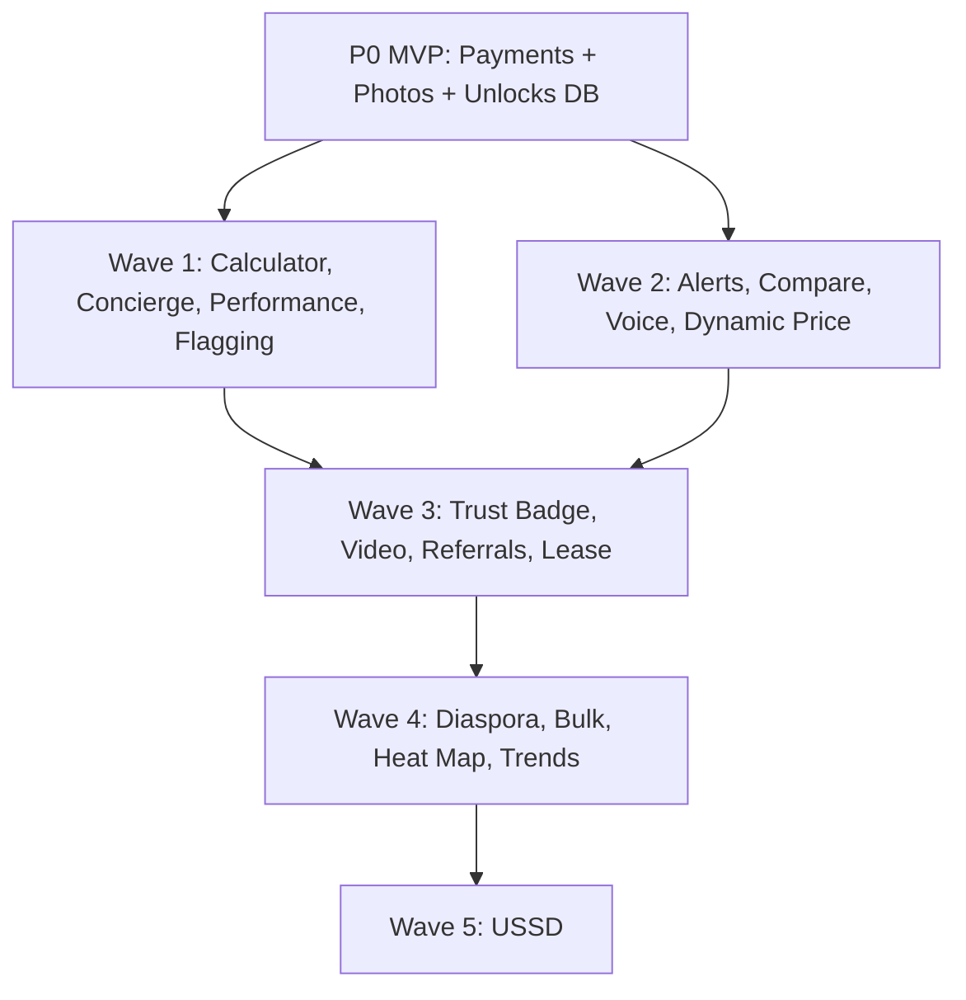

# Casa — Feature Backlog

**Status:** Implemented in codebase (v0.2.0) — run `npm run db:migrate` for migration `002_features.sql`  
**Related docs:** `Casa_Product_Plan (1).docx`, `Developer_Handover.md`

This document captures the full Casa feature vision — including ideas beyond the original product plan. All features below are **intended for the platform**; they are phased by dependency, effort, and business impact.

---

## Summary: Can we include all of these?

**Yes — as the product roadmap.** All 18 features fit Casa’s vision and complement what’s already built.

**No — not all at once.** They should ship in waves after the MVP gaps are closed (payments, photos, fraud detection). Estimated total build: **~9–14 months** with a small team, assuming P0/P1 from the handover doc is done first.

| Wave | Focus | Features | Status |
|------|-------|----------|--------|
| **MVP** | Foundation | Payments stub, photos, core flows | ✅ |
| **All 18 features** | Full backlog | See table below | ✅ Wired in app |

---

## For Tenants

### 1. Saved Search Alerts

**What:** Tenant describes their ideal listing once. Claude stores preferences and sends a WhatsApp ping when a new matching house is listed.

**Why:** Reduces repeat searching every few days; drives return engagement.

**Depends on:** Working search filters, `ANTHROPIC_API_KEY`, notification cron or event hook on `houses` insert.

**Schema (proposed):**
```sql
CREATE TABLE saved_searches (
  id UUID PRIMARY KEY,
  tenant_phone VARCHAR(20) REFERENCES users(phone),
  query_json JSONB NOT NULL,        -- Claude-parsed filters
  raw_description TEXT,
  active BOOLEAN DEFAULT TRUE,
  created_at TIMESTAMPTZ DEFAULT NOW()
);
```

**Flow:** Tenant menu → "Save alert" → describe needs → confirm → background job matches new `houses` rows → WhatsApp outbound.

**Effort:** Medium | **Wave:** 2 | **Priority:** High

---

### 2. Side-by-Side Comparison

**What:** Tenant shortlists 2–3 houses. Claude generates a comparison (price, distance, facilities, price fairness).

**Why:** Faster decision-making; reduces unlock waste on wrong properties.

**Depends on:** Search results flow, Claude API, shortlist state in Redis or DB.

**Schema (proposed):**
```sql
CREATE TABLE shortlists (
  tenant_phone VARCHAR(20),
  house_id VARCHAR(20),
  added_at TIMESTAMPTZ DEFAULT NOW(),
  PRIMARY KEY (tenant_phone, house_id)
);
```

**Flow:** After search → "Add to compare" → when 2+ saved → "Compare" → Claude summary message.

**Effort:** Medium | **Wave:** 2 | **Priority:** Medium

---

### 3. Total Cost Calculator

**What:** Shows one number: rent × months upfront + 5,000 KES unlock fee = **"You need X KES to move in."**

**Why:** Reduces surprise drop-off at payment step.

**Depends on:** Nothing new — uses existing `rent`, `months_upfront`, `UNLOCK_FEE_KES`.

**Flow:** Inject into house detail message before unlock prompt. Optional standalone command: `COST CASA-2847`.

**Effort:** Small | **Wave:** 1 | **Priority:** High

---

### 4. Diaspora Mode

**What:** User abroad searches and pays on behalf of family in Kenya. Listing + landlord contact sent to **both** WhatsApp numbers.

**Why:** Large diaspora audience remitting rent; family may not have WhatsApp skills.

**Depends on:** Payment verification, unlock persistence, secondary recipient field.

**Schema (proposed):**
```sql
ALTER TABLE unlocks ADD COLUMN beneficiary_phone VARCHAR(20);
ALTER TABLE unlocks ADD COLUMN payer_phone VARCHAR(20);  -- may differ from tenant_phone
```

**Flow:** Tenant menu → "Search for family" → enter family member's number → search/pay → both receive contact + maps link.

**Effort:** Large | **Wave:** 4 | **Priority:** Medium

---

### 5. Post-Unlock Concierge

**What:** After unlock, Claude **proactively** sends visit checklist, negotiation tips, and required documents — not waiting for the tenant to ask.

**Why:** Product plan §5.6; increases perceived value of the 5,000 KES fee.

**Depends on:** Unlock flow writing to `unlocks` table; Claude API.

**Flow:** On successful unlock → trigger 3-message sequence (checklist → negotiation → documents), tailored to listing facilities and neighbourhood.

**Effort:** Small–Medium | **Wave:** 1 | **Priority:** High

---

### 6. Voice Note Support

**What:** Users send WhatsApp voice notes. Claude transcribes (or Whisper) and processes as text for search/listing.

**Why:** Lower barrier for less literate or older users; aligns with Kenya usage patterns.

**Depends on:** WhatsApp audio message handling, transcription API (Whisper or Claude).

**Technical:** `message.type === "audio"` in webhook → download media from Meta → transcribe → pass to existing `parseListingFromText` / `parseSearchFromText`.

**Effort:** Medium | **Wave:** 2 | **Priority:** High

---

## For Landlords

### 7. Listing Performance Pings

**What:** Weekly WhatsApp: *"Your CASA-2847 got 12 views and 2 unlocks this week."*

**Why:** Keeps landlords engaged; signals when to adjust price.

**Depends on:** View tracking (new), unlock data in `unlocks` table.

**Schema (proposed):**
```sql
CREATE TABLE listing_views (
  id UUID PRIMARY KEY,
  house_id VARCHAR(20) REFERENCES houses(house_id),
  tenant_phone VARCHAR(20),
  viewed_at TIMESTAMPTZ DEFAULT NOW()
);
```

**Effort:** Medium | **Wave:** 1 | **Priority:** High

---

### 8. Dynamic Price Suggestions

**What:** Claude compares stale listings (no unlocks in 2 weeks) to similar active ones and suggests a price tweak.

**Why:** Improves liquidity; reduces dead inventory.

**Depends on:** Unlock history, listing performance data, scheduled job (cron).

**Flow:** Weekly cron → find stale listings → Claude analysis → WhatsApp suggestion to landlord.

**Effort:** Medium | **Wave:** 2 | **Priority:** Medium

---

### 9. Auto-Generated Rental Agreement

**What:** Claude drafts a simple English lease pre-filled from listing details when a tenant is ready to move in.

**Why:** End-to-end value; differentiation from informal word-of-mouth market.

**Depends on:** Unlock event, landlord + tenant phones, listing data.

**Flow:** Post-unlock → landlord asked "Generate lease?" → Claude PDF/text → sent to both parties.

**Effort:** Medium–Large | **Wave:** 3 | **Priority:** Medium

---

### 10. Multi-Property Bulk Management

**What:** Landlords with several units manage all listings from one thread (list all, bulk deactivate, bulk renew).

**Why:** Owners with multiple properties need one WhatsApp thread, not one-thread-per-house.

**Depends on:** Solid single-listing flow.

**Flow:** Landlord menu → "My listings" / bulk manage → numbered actions per listing or bulk commands.

**Effort:** Large | **Wave:** 4 | **Priority:** Medium

---

## Trust & Safety

### 11. Tenant Trust Badge

**What:** Light verification (ID photo or Paystack-linked KYC). Landlords see "✅ Verified tenant" before engaging.

**Why:** Cuts scam risk both ways; landlords more willing to respond.

**Depends on:** KYC provider or manual admin review, `users` table extension.

**Schema (proposed):**
```sql
ALTER TABLE users ADD COLUMN verified BOOLEAN DEFAULT FALSE;
ALTER TABLE users ADD COLUMN verified_at TIMESTAMPTZ;
ALTER TABLE users ADD COLUMN verification_method VARCHAR(30); -- 'id', 'paystack', 'manual'
```

**Effort:** Large | **Wave:** 3 | **Priority:** Medium

---

### 12. Community Flagging

**What:** Tenants who visit a house and find it misrepresented can flag it. Feeds Claude fraud-detection scoring.

**Why:** Ground-truth signal beyond AI; builds trust in listings.

**Depends on:** Prior unlock (proves visit intent), `listing_reviews` table (exists).

**Flow:** Post-unlock menu → "Report misrepresentation" → reason → creates `listing_reviews` row → admin moderation queue.

**Effort:** Small–Medium | **Wave:** 1 | **Priority:** High

---

### 13. Short Video Walkthroughs

**What:** Optional video upload. Claude analyzes like photos for a "Verified+" trust tier.

**Why:** Stronger signal than photos alone; premium listing tier opportunity.

**Depends on:** Cloudinary video support, Claude Vision/video API (or frame extraction).

**Schema (proposed):**
```sql
ALTER TABLE houses ADD COLUMN videos TEXT[] DEFAULT '{}';
ALTER TABLE houses ADD COLUMN trust_tier VARCHAR(20) DEFAULT 'standard'; -- 'standard', 'verified_plus'
```

**Effort:** Large | **Wave:** 3 | **Priority:** Low–Medium

---

## Growth & Reach

### 14. Referral Credits

**What:** Free unlock or featured-listing credit when a referred landlord or tenant completes a transaction.

**Why:** Low-CAC growth in Facebook groups and campus communities.

**Schema (proposed):**
```sql
CREATE TABLE referrals (
  id UUID PRIMARY KEY,
  referrer_phone VARCHAR(20) REFERENCES users(phone),
  referred_phone VARCHAR(20) REFERENCES users(phone),
  status VARCHAR(20) DEFAULT 'pending', -- pending, completed
  reward_type VARCHAR(30),              -- free_unlock, featured_listing
  rewarded_at TIMESTAMPTZ
);

CREATE TABLE credits (
  id UUID PRIMARY KEY,
  user_phone VARCHAR(20) REFERENCES users(phone),
  credit_type VARCHAR(30),
  used BOOLEAN DEFAULT FALSE,
  expires_at TIMESTAMPTZ
);
```

**Effort:** Medium | **Wave:** 3 | **Priority:** Medium

---

### 15. ~~Agent Commission Mode~~ — REMOVED

**Status:** Rejected for Casa Kenya.

Casa Kenya connects **landlords and tenants directly**. Agent commission / middleman fee sharing is out of scope and conflicts with the product mission to reduce exploitation.

---

### 16. USSD / Feature-Phone Fallback

**What:** Basic listing/search path for rural landlords without smartphones or WhatsApp.

**Why:** Massive reach expansion beyond smartphone users.

**Depends on:** Telco USSD gateway partnership (MTN Kenya, Airtel, etc.), simplified text-only flows, separate state machine.

**Technical:** Entirely new channel — not a WhatsApp extension. Likely third-party USSD provider (e.g. Africa's Talking, local telco API).

**Effort:** Very Large | **Wave:** 5 | **Priority:** Strategic (long-term)

---

## Data & Intelligence

### 17. Live Rent Heat Map

**What:** Aggregated, anonymized neighbourhood pricing sent as a WhatsApp image.

**Why:** Product plan §8 data insights revenue; genuinely useful to tenants.

**Depends on:** Sufficient listing volume, image generation (Canvas/Chart API), admin data pipeline.

**Delivery:** Tenant asks "rent map Westlands" → server generates PNG → send via WhatsApp media API.

**Effort:** Large | **Wave:** 4 | **Priority:** Medium (needs data volume first)

---

### 18. Market Trend Reports

**What:** Monthly message: *"Average rent in Westlands moved up 5%."* Keeps landlords checking Casa.

**Why:** Retention + data monetization (banks, developers, government).

**Depends on:** Historical rent data, scheduled analytics job, minimum listing threshold per area.

**Effort:** Medium–Large | **Wave:** 4 | **Priority:** Medium (needs data volume first)

---

## Cross-Feature Dependencies



**Hard blockers before any Wave 1+ feature:**
1. Payment verification (Paystack/Flutterwave)
2. `unlocks` table populated on real payment
3. Cloudinary photo pipeline (for trust features)

---

## Mapping to Original Product Plan

| Original plan item | Backlog feature |
|--------------------|-----------------|
| §5.2 AI recommendations | Saved search alerts + comparison |
| §5.6 Tenant AI assistant | Post-unlock concierge |
| §5.4 Suspicious listing detection | Community flagging (extends it) |
| §5.5 Photo analysis | Short video walkthroughs (extends it) |
| §8 Featured listing | Referral credits (featured as reward) |
| §8 API access | _(out of scope for now)_ |
| §8 Data insights | Heat map + market trend reports |
| §9 Direct landlord–tenant model | Bulk management for owners (no agent fees) |
| §9 Rural reach | USSD fallback |

---

## Admin Dashboard Extensions (per wave)

| Wave | Admin additions |
|------|-----------------|
| 1 | Flagged-by-community queue, listing view/unlock charts |
| 2 | Saved search volume, voice note error logs |
| 3 | Verification review queue, referral/credit ledger |
| 4 | Rent analytics export |
| 5 | USSD session monitor |

---

## What NOT to build yet

Until MVP is live and has real users:

- USSD (needs telco deal + separate product)
- Heat map / trend reports (needs meaningful data volume)
- Agent / middleman fee sharing (rejected — direct landlord–tenant only)
- Diaspora mode (needs stable payment + unlock flow)

---

## Next Action for Dev Team

1. Complete **P0** from `Developer_Handover.md` §16
2. Ship **Wave 1** (highest ROI, lowest effort): cost calculator, post-unlock concierge, community flagging, listing performance pings
3. Track each feature in this doc with status: `planned` → `in progress` → `shipped`

---

*All 18 features are on the Casa roadmap. Phasing ensures the platform earns trust and revenue before scaling complexity.*
